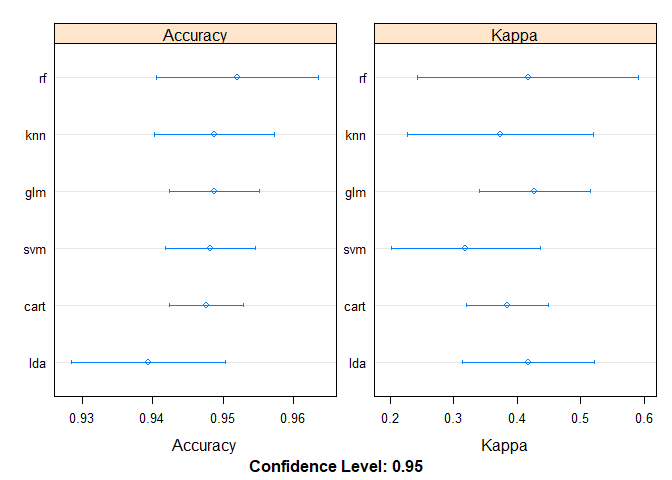
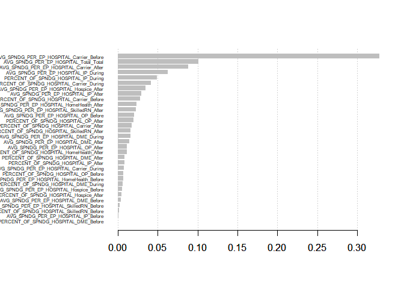
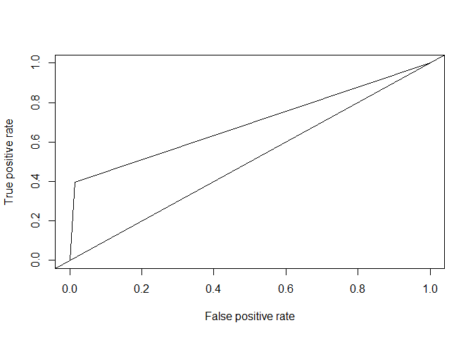
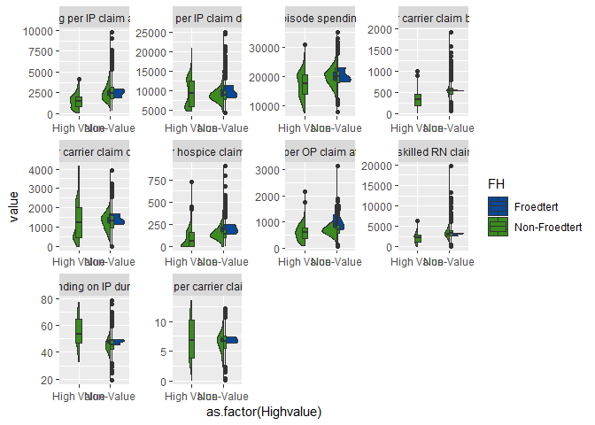
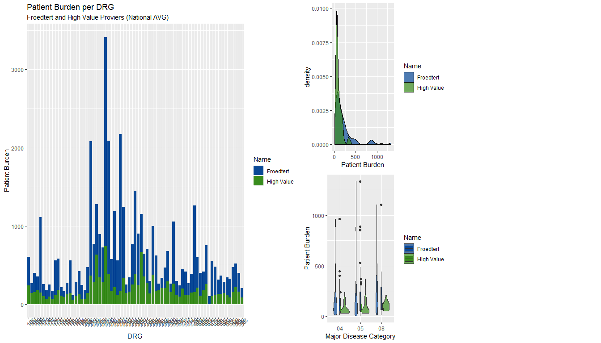
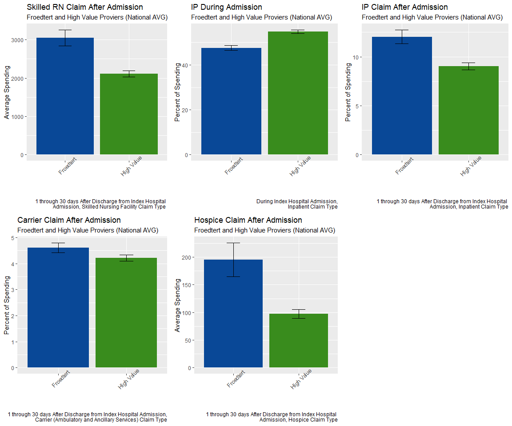

## Data Wrangling

Once the datasets are loaded, we use the Medicare Provider Charge Inpatient data to calculate the average covered charges, total payments, and Medicare payments. These are also calculated per discharge to find the percent of the total bill paid by CMS.

In order to coalesce data from across these datasets, the "Payment Measure ID" is assigned an inferred "Major Diagnostic Category" (MDC) allowing the quality outcome score to be mapped to the CMS Inpatient provider data via corresponding MDC and DRG. In the provider payment and value of care hospital dataset, the Medicare "Value of Care Category" is translated into a numerical risk score. This forms the indication of value used throughout the analysis (see script for translation details). 


The Medicare spending by claim dataset is transformed to match payment episode period and claim type back to the Medicare Hospital Spending dataset above. 


## Model Comparison 

Using the Caret package: General Linear Model (GLM), Linear Discriminant Analysis (LDA), Recursive Partitioning and Regression Trees (RPART), k-nearest neighbors (KNN), Support Vector Machines (SVM), Random Forest (RF) were all evaluated for highest accuracy. 
<!-- -->


## Feature Importance (XGBoost)

XGBoost was also performed, using the caret package for hyperparameter tuning and the XGBoost package (better local performance) for the final model

```
##     nrounds max_depth eta gamma colsample_bytree min_child_weight
## 100      50         5 0.1     0                1                5
##     subsample
## 100         1
```


Plot of feature importance by Gain, or the relative contribution of each feature to the overall model. Increased gain would reflect increased importance:

<!-- -->

Model performance is poor, statistically insignificant,


```
## Confusion Matrix and Statistics
## 
##           Reference
## Prediction   0   1
##          0 833  38
##          1  12  25
##                                          
##                Accuracy : 0.9449         
##                  95% CI : (0.928, 0.9589)
##     No Information Rate : 0.9306         
##     P-Value [Acc > NIR] : 0.047695       
##                                          
##                   Kappa : 0.4729         
##  Mcnemar's Test P-Value : 0.000407       
##                                          
##             Sensitivity : 0.9858         
##             Specificity : 0.3968         
##          Pos Pred Value : 0.9564         
##          Neg Pred Value : 0.6757         
##              Prevalence : 0.9306         
##          Detection Rate : 0.9174         
##    Detection Prevalence : 0.9593         
##       Balanced Accuracy : 0.6913         
##                                          
##        'Positive' Class : 0              
## 
```

ROC Plot

<!-- -->

AUC Value


```
## [[1]]
## [1] 0.03911694
```


## Top 10 Significant features (XGBoost)

<!-- -->


<!-- -->


<!-- -->


Datasets can be found below: <br>
DRG Data: https://data.cms.gov/inpatient-provider-lookup/view-data <br>
HSP Data: https://data.medicare.gov/Hospital-Compare/Medicare-Hospital-Spending-by-Claim/nrth-mfg3 <br>
Provider (SER): https://data.medicare.gov/Hospital-Compare/Payment-and-value-of-care-Hospital/c7us-v4mf <br>
Zip: https://public.opendatasoft.com/explore/dataset/us-zip-code-latitude-and-longitude/export/ <br>
*Note: The CSV's provided reflect modified headers (spaces removes) not included in the script here.* <br>

