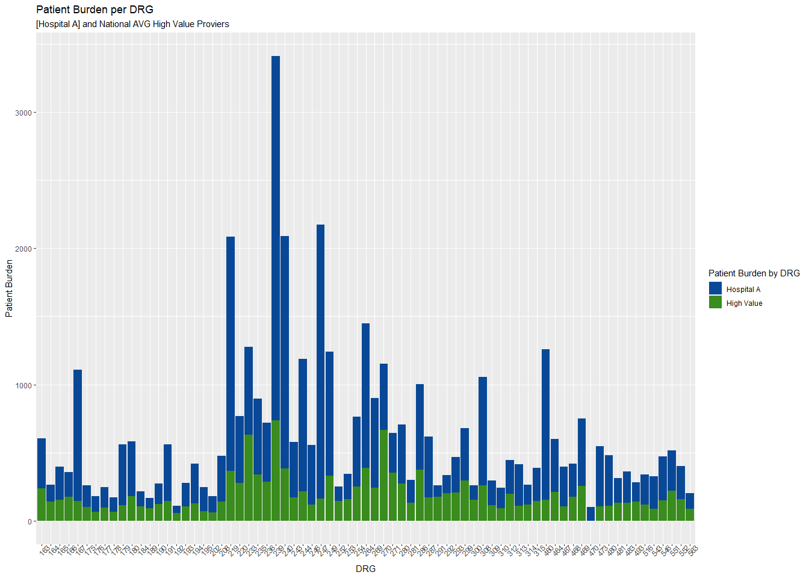
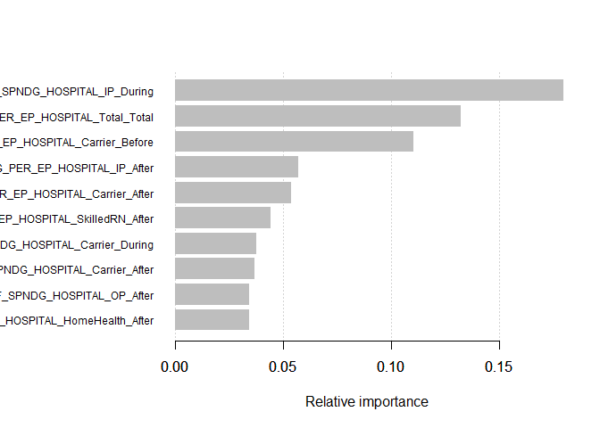
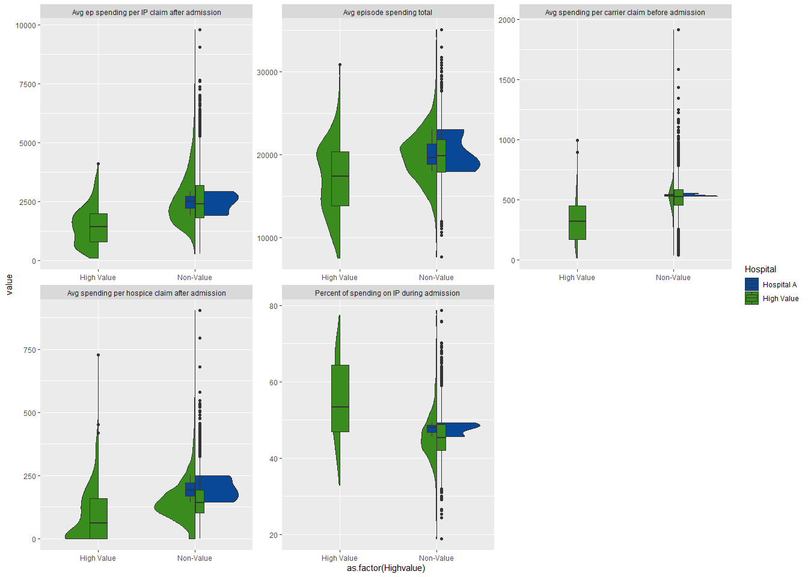

## Executive Summary

With an increasingly competitive healthcare market, systems will be forced to compete on value. By increasing provider value and lowering cost to the patient (patient burden) Froedtert can maximize its competitiveness in the regional market.

## Case Prompt

*Acutely aware of the challenges outlined above F&MCW hospital executives and clinical leaders are interested seeing F&MCW’s “Medicare Value Story” – a data-driven narrative about F&MCW’s Medicare population trends. The core questions articulated by the executives are detailed below: 
How does F&MCW compare to other health systems across the country when it comes to Medicare population trends (quality metrics, volume metrics, and cost metrics)? Where is F&MCW doing well and where do we have opportunities to improve? What additional insights can we derive from analyzing the large troves of public Medicare data provided by the Centers for Medicare and Medicaid (CMS)?*


## Data Wrangling

Once the datasets are loaded, we use the “Medicare Provider Charge Inpatient DRG ALL FY 2016” (DRG Dataset) to calculate the average covered charges, total payments, and Medicare payments. These are also calculated per discharge to find the percent of the total bill paid by CMS. Patient cost burden was determined calculating the difference between the “Average Total Payments” and “Average Medicare Payments” to arrive at the remaining patient balance. 

***


Table: Medicare Provider Charge Inpatient data FY2016

DRGDefinition                                                     ProviderId  ProviderName                     ProviderStreetAddress   ProviderCity   ProviderState    ProviderZipCode  HospitalReferralRegion(HRR)Description    TotalDischarges  AverageCoveredCharges   AverageTotalPayments   AverageMedicarePayments   FH   drgID   FHdrgflag   WI        ACC      ATP        AMP   ACCperDischarge   ATPperDischarge   AMPperDischarge  PercentCMSperDischarge 
---------------------------------------------------------------  -----------  -------------------------------  ----------------------  -------------  --------------  ----------------  ---------------------------------------  ----------------  ----------------------  ---------------------  ------------------------  ---  ------  ----------  ---  --------  -------  ---------  ----------------  ----------------  ----------------  -----------------------
001 - HEART TRANSPLANT OR IMPLANT OF HEART ASSIST SYSTEM W MCC         10033  UNIVERSITY OF ALABAMA HOSPITAL   619 SOUTH 19TH STREET   BIRMINGHAM     AL                         35233  AL - Birmingham                                        13  $1,016,806.46           $296,937.00            $150,139.69               No   001     No          No    1016806   296937   150139.7          78215.88          22841.31          11549.21  14.77                  

***


In order to fairly compare provider value to DRG, the DRG dataset was mapped to their corresponding Major Diagnostic Category (MDC). Similarly the provider dataset (display id AMI/HF/PN/HIP) was mapped to MDC. Only the following DRG/MCD ranges were conserved across both datasets used for further comparison: 
<br>


Designate Payment measure ID with MDC value | (MDC ID xxx DRG Range)
------------ | -------------
04	Diseases and Disorders of the Respiratory System |	163 - 208
05	Diseases and Disorders of the Circulatory System |	215 - 316
08	Diseases and Disorders of the Musculoskeletal System And Connective Tissue |453 - 566

<br>

In the "Provider Value of Care - Hospital"  (SER Data) dataset, the Medicare "Value of Care Category" is translated into a numerical risk score. This forms the indication of value used throughout the analysis (see script for translation details). High value providers were any who achieved a combined average score of >= 7.

***


Table: Provider Value of Care - Hospital

 ProviderID  Hospitalname             Address              City        State    ZIPCode  Countyname   Phonenumber      Paymentmeasurename                  PaymentmeasureID   Paymentcategory             Denominator     Payment         Lowerestimate   Higherestimate   Paymentfootnote                                          Valueofcaredisplayname               ValueofcaredisplayID   Valueofcarecategory   Valueofcarefootnote                                      Measurestartdate   Measureenddate 
-----------  -----------------------  -------------------  ----------  ------  --------  -----------  ---------------  ----------------------------------  -----------------  --------------------------  --------------  --------------  --------------  ---------------  -------------------------------------------------------  -----------------------------------  ---------------------  --------------------  -------------------------------------------------------  -----------------  ---------------
     190164  BYRD REGIONAL HOSPITAL   1020 FERTITTA BLVD   LEESVILLE   LA         71446  VERNON       (337) 239-9041   Payment for heart attack patients   PAYM_30_AMI        Number of Cases Too Small   Not Available   Not Available   Not Available   Not Available    1 - The number of cases/patients is too few to report.   Value of Care Heart Attack measure   MORT_PAYM_30_AMI       Not Available         1 - The number of cases/patients is too few to report.   7/1/2014           6/30/2017      

***


The Medicare spending by claim (HSP) dataset is transformed to match payment episode period and claim type back to the Medicare Hospital Spending (DRG) dataset above. 

***


Table: Medicare Spending by Claim

HOSPITAL_NAME                       PROVIDER_ID  STATE   PERIOD                                          CLAIM_TYPE            AVG_SPNDG_PER_EP_HOSPITAL   AVG_SPNDG_PER_EP_STATE   AVG_SPNDG_PER_EP_NATIONAL  PERCENT_OF_SPNDG_HOSPITAL   PERCENT_OF_SPNDG_STATE   PERCENT_OF_SPNDG_NATIONAL    START_DATE   END_DATE
---------------------------------  ------------  ------  ----------------------------------------------  -------------------  --------------------------  -----------------------  --------------------------  --------------------------  -----------------------  --------------------------  -----------  ---------
SOUTHEAST ALABAMA MEDICAL CENTER          10001  AL      1 to 3 days Prior to Index Hospital Admission   Home Health Agency                           21                       15                          13  0.10%                       0.08%                    0.06%                           1012017   12312017

***


<br>
<br>

Overview of difference in patient burden between F&MCW and "High Value" healthcare providers. This shows that per DRG (top), overall (lower left), and per MDC (lower right) high value providers have lower patient cost burden. F&MCW has 188 DRG's represented in the dataset, of those 91% (172 of 188) have opportunity for value improvement. With total payments at $121.2 million, opportunity for value improvement is just over 21 million.


<br>

<!-- --><!-- -->

<br>
<br>

To determine the most important episode spending characteristics of high value providers, various machine learning models were employed. Data was preprocessed to remove near zero variance, and highly correlated (cutoff = 0.75) predictors, then normalized (centered and scaled) for increased regression performance. Data was randomly sampled into 70/30 training/testing subsets. All models (not XGBoost) were trained using the train function of the caret package with repeated 10-fold cross validation for accuracy in model evaluation.  <br>

## Model Comparison 

General Linear Model (GLM), Linear Discriminant Analysis (LDA), Recursive Partitioning and Regression Trees (RPART), k-nearest neighbors (KNN), Support Vector Machines (SVM), Random Forest (RF) were all evaluated for highest accuracy. (XGBoost was performed seperately using the XGBoost package and is not shown here).

<!-- -->


<br>

## Feature Importance (XGBoost)

XGBoost hyperparameter tuning was perfored using the caret implementation. However, this implementation is not as performant as the native XGBoost package, which was used for the final model using the parameters below:


```
##     nrounds max_depth eta gamma colsample_bytree min_child_weight subsample
## 113      50        10 0.1     0                1                3         1
```

The resulting top 10 features, in order of relative importance are shown below:

<!-- -->

## XGBoost Model Performance

XGBoost attained the highest accuracy of the models tested at 94.8%, with good sensitivity / recall (true positive rate), F1-score of 97.26% but insignificant statistical performance (P-value > 0.05%). Low specificity is not overly concerning in this application.


```
## Confusion Matrix and Statistics
## 
##           Reference
## Prediction   0   1
##          0 844  38
##          1  13  13
##                                           
##                Accuracy : 0.9438          
##                  95% CI : (0.9268, 0.9579)
##     No Information Rate : 0.9438          
##     P-Value [Acc > NIR] : 0.5371645       
##                                           
##                   Kappa : 0.3115          
##                                           
##  Mcnemar's Test P-Value : 0.0007775       
##                                           
##             Sensitivity : 0.9848          
##             Specificity : 0.2549          
##          Pos Pred Value : 0.9569          
##          Neg Pred Value : 0.5000          
##              Prevalence : 0.9438          
##          Detection Rate : 0.9295          
##    Detection Prevalence : 0.9714          
##       Balanced Accuracy : 0.6199          
##                                           
##        'Positive' Class : 0               
## 
```


Focusing in on the top 5 features (for brevity), Violin plots show the distribution of episode spending between high-value, and non-high value providers (FH spending shown in blue). 

<!-- -->


## High Value Comparison

Comparing FH rates to those of High-value providers only we more clearly see the areas of opportunity for reducing patient cost burden. For example, high-value providers spend more during the inpatient admission but less in total average episode spending. Additionally, F&MCW should more closely evaluate ways to reduce average spending in post acute care (Inpatient post-admission and hospice claims) in addition to reducing ambulatory and ancillary services prior to admission (carrier claim pre-admission).

<!-- -->


## Data

Datasets can be found below: <br>
DRG Data: https://data.cms.gov/inpatient-provider-lookup/view-data <br>
HSP Data: https://data.medicare.gov/Hospital-Compare/Medicare-Hospital-Spending-by-Claim/nrth-mfg3 <br>
Provider (SER): https://data.medicare.gov/Hospital-Compare/Payment-and-value-of-care-Hospital/c7us-v4mf <br>
Zip: https://public.opendatasoft.com/explore/dataset/us-zip-code-latitude-and-longitude/export/ <br>
*Note: The CSV's provided reflect modified headers (spaces removed) not included in the script here.* <br>
